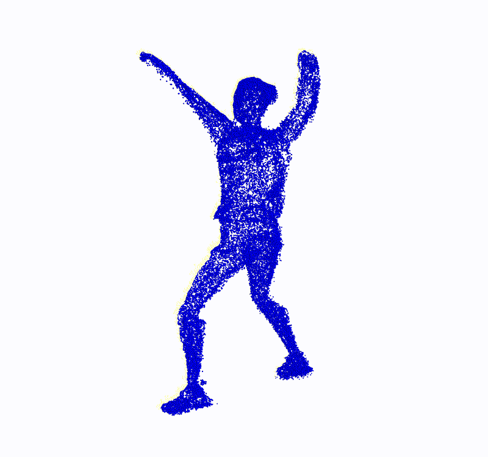

# Pure Python SSDR
## Implementation of Le and Deng's paper "Smooth Skinning Decomposition with Rigid Bones" in pure python

This is a Python script to run SSDR for learning this algorithm, which has been annotated every line in `Annotated_SSDR.py`.

To reach the mesh data or pointcloud data, please refer to 4DGS or I would offer a Google Drive later.

## How to use
See the botton explain in each file
you can use `pure_python_SSDR.py` to run your mesh sequence or pointcloud sequence. And visualize the result by using `pointcloud_viewer.py`.

I also provide a version to use this algorithm in [Deform-GS](https://github.com/ingra14m/Deformable-3D-Gaussians) in `Gaussian2SSDR.py`.

Some results:
- This result was generated from a version where bone re-initialization had not been implemented.
    - 

## Other info
Most of the code is based on references from repository [SSDR](https://github.com/dalton-omens/SSDR) and repository [dem-bones](https://github.com/electronicarts/dem-bones).

I am still developing bone re-initialization part.
